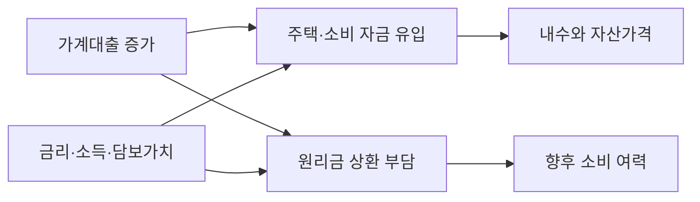

한국은행이 8월 19일 발표한 ‘2026년 2/4분기중 가계신용(잠정)’에 따르면 6월 말 가계신용 잔액은 2,019.8조원으로 전분기보다 25.9조원 늘었습니다. 사상 최대라는 표현보다 중요한 것은 증가분의 대부분이 어디에서 나왔는지입니다. <mark>전체 증가액 25.9조원 가운데 가계대출이 24.9조원을 차지했고, 판매신용 증가는 0.9조원에 그쳤습니다.</mark> 이번 변화는 카드 사용보다 금융기관 대출 흐름을 먼저 분석해야 한다는 뜻입니다.

## 숫자를 같은 기준으로 놓기

가계신용은 가계대출과 판매신용을 합친 통계입니다. 가계대출은 예금은행과 비은행예금취급기관, 기타금융기관 등이 가계에 공급한 대출을 포괄하고, 판매신용은 신용카드 할부처럼 재화·서비스 구매 과정에서 생긴 외상거래를 뜻합니다. 총액만 보면 두 경로가 섞이므로 금리와 소비에 미치는 영향을 구분하기 어렵습니다.

| 구분 | 2026년 2분기 말 잔액 | 전분기 대비 | 해석할 때 볼 지점 |
| --- | ---: | ---: | --- |
| 가계신용 전체 | 2,019.8조원 | +25.9조원 | 부채 총량의 방향 |
| 가계대출 | 1,891.3조원 | +24.9조원 | 주택·기타대출과 취급기관별 변화 |
| 판매신용 | 128.5조원 | +0.9조원 | 카드 결제와 소비 흐름 |

세 항목은 ‘잔액’이며 분기 동안 새로 빌린 금액과 같지 않습니다. 상환된 대출과 신규 취급액이 상계된 결과이고, 발표값도 잠정치입니다. 반올림 때문에 세부 항목의 합과 총계 증감이 정확히 일치하지 않을 수 있습니다. <mark>잔액 증가를 곧바로 가계의 소비 여력 증가로 해석하면 상환 부담과 대출 용도를 빠뜨리게 됩니다.</mark>

## 금융시장으로 전달되는 경로

가계대출 확대는 은행의 자산 성장에는 우호적일 수 있지만, 예대율과 자본 규제, 대손비용을 함께 봐야 합니다. 담보가치와 차주의 소득이 안정적이면 단기 건전성 부담이 제한될 수 있으나, 변동금리 비중이 높고 소득 증가가 약하면 금리 충격이 원리금 상환 부담으로 빠르게 전달됩니다. 같은 1원의 대출 증가라도 고정금리 주택담보대출과 고금리 신용대출의 위험 구조는 다릅니다.

따라서 기본 시나리오는 대출 증가가 주택 거래와 일부 소비를 지지하되, 이후 원리금 상환이 가처분소득을 제약하는 흐름입니다. 대안 시나리오는 소득과 고용이 견조하고 고정금리 비중이 높아 상환 부담이 완만하게 흡수되는 경우입니다. 반대로 시장금리가 다시 오르거나 주택가격이 약해지면 차주의 현금흐름과 금융기관 건전성이 동시에 압박받을 수 있습니다.

## ‘금리 인하 기대’만으로 설명할 수 없는 이유

정책금리가 움직이지 않아도 실제 가계가 적용받는 대출금리는 은행채 금리, 조달비용, 가산금리와 우대조건에 따라 달라집니다. 대출 규제와 은행별 총량 관리도 취급액에 영향을 줍니다. 한국은행의 월별 금융시장 동향은 은행 가계대출을 빠르게 보여주지만, 분기 가계신용은 비은행과 판매신용까지 범위가 더 넓습니다. 두 통계는 조사 범위와 기준 시점이 다르므로 수치를 직접 더하지 말고 방향을 교차 확인해야 합니다.

<mark>이번 통계만으로 부채의 건전성이 악화됐다고 단정할 수도, 소비 회복이 강해졌다고 결론낼 수도 없습니다.</mark> 대출의 용도·금리유형·차주 소득과 연체율이 함께 확인돼야 하기 때문입니다. 특히 총량 증가가 특정 지역의 주택대출이나 일부 고소득 차주에 집중됐는지에 따라 거시적 파급효과가 달라집니다.

## 다음 발표에서 확인할 체크포인트

첫째, 가계대출 증가가 예금은행과 비은행 가운데 어디에 집중되는지 봐야 합니다. 규제가 강한 업권에서 다른 업권으로 수요가 이동하면 총량이 같아도 평균 금리와 신용위험이 달라질 수 있습니다. 둘째, 주택담보대출과 기타대출의 방향을 분리해야 합니다. 셋째, 신규 취급액 기준 금리와 잔액 기준 금리를 함께 봐야 금리 변화가 기존 차주에게 전달되는 속도를 판단할 수 있습니다.

넷째, 연체율과 차주별 부채 통계를 확인해야 합니다. 잔액은 규모를 보여주지만 상환 능력을 직접 보여주지는 않습니다. 다섯째, 주택 거래량과 소매판매 등 실물지표를 대조해야 합니다. 대출이 늘어도 기존 고금리 부채의 대환에 쓰였다면 신규 소비나 투자로 이어지는 효과는 제한적입니다.

이번 2분기 수치는 가계신용이 2,000조원을 넘어선 상태에서 증가 속도가 다시 커졌다는 경고등에 가깝습니다. 다만 경고등의 색을 판단하려면 다음 분기의 구성과 건전성 지표가 필요합니다. 이 글은 한국은행 공식 통계를 해설한 비개인화 정보이며 투자·대출 자문이 아닙니다. 금융상품을 결정할 때는 적용금리, 상환 방식, 중도상환 조건과 손실 가능성을 별도로 확인해야 합니다.
