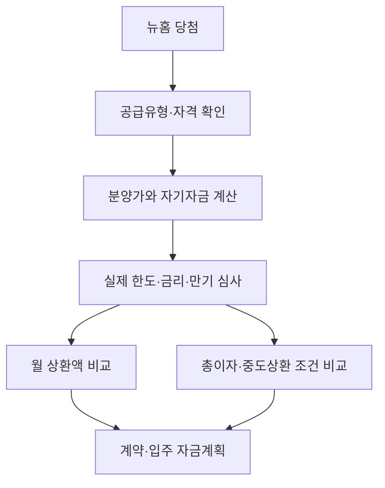

국토교통부는 8월 25일 뉴홈 청약자 대표 간담회 뒤 전용 모기지 적용 방안을 확정했다고 발표했습니다. 공식 발표에서 확인되는 핵심은 대출 만기를 최대 40년으로 두고 고정금리 1.9~3.0%를 적용한다는 것입니다. <mark>그러나 ‘40년·1.9%’는 모든 당첨자에게 동일하게 적용되는 하나의 대출 조건이 아니라, 최대 만기와 금리 범위를 표시한 정책의 외곽선입니다.</mark> 실제 자금계획은 공급유형과 개인별 심사 조건을 확인한 뒤 세워야 합니다.

## 확정된 것과 아직 확인할 것을 나누기

이번 발표는 청약자 대표 9명의 의견을 들은 뒤 전용 모기지의 만기와 고정금리 범위를 확정했다는 내용입니다. 최대 만기가 길어지면 같은 원금을 원리금분할상환할 때 월 납입액은 낮아질 수 있습니다. 반면 상환 기간이 길수록 원금을 천천히 갚기 때문에 전체 이자 부담은 커질 수 있습니다. 금리가 고정돼도 만기의 비용까지 고정적으로 유리해지는 것은 아닙니다.

| 항목 | 공식 발표에서 확인된 내용 | 청약자가 추가로 확인할 내용 |
| --- | --- | --- |
| 만기 | 최대 40년 | 연령·상품별 실제 선택 가능 만기 |
| 금리 | 고정 1.9~3.0% | 적용 구간, 우대·가산 조건, 적용 시점 |
| 대상 | 뉴홈 전용 모기지 | 공급유형·단지·당첨자별 이용 자격 |
| 실행 | 적용 방안 확정 | 대출한도, 심사, 실행기관과 필요 서류 |

국토부 보도자료에 적힌 문구를 넘어선 세부 조건은 모집공고와 후속 대출 안내가 기준입니다. 보도자료는 정책 방향을 설명하지만 개별 단지의 계약서나 금융약정을 대신하지 않습니다. <mark>당첨자는 ‘발표됐는가’와 ‘내 계약에 적용되는가’를 분리해 확인해야 합니다.</mark>

## 월 부담과 총비용은 반대 방향으로 움직일 수 있다

만기를 늘리면 일반적으로 월 상환액은 감소합니다. 이는 입주 초기의 현금흐름을 안정시키는 장점이 있습니다. 하지만 원금이 오래 남아 있어 총이자는 증가할 수 있습니다. 예를 들어 동일한 원금과 금리라도 20년과 40년 원리금균등상환은 월 납입액과 총이자가 다릅니다. 정확한 차이는 실제 대출액, 적용금리, 거치 여부와 상환 방식이 정해져야 계산할 수 있습니다.

자금계획에서는 분양대금만 보면 안 됩니다. 계약금과 중도금, 잔금의 납부 시점, 취득 관련 비용, 입주 뒤 관리비와 이사비를 시간순으로 놓아야 합니다. 대출 실행일이 잔금일과 맞는지, 중도금 대출이 전용 모기지로 자동 전환되는지도 공고문과 취급기관에 확인해야 합니다. 자동 전환을 전제로 계약하면 실행 시점의 자금 공백이 생길 수 있습니다.

## 공급유형에 따라 경제적 구조가 달라진다

뉴홈은 하나의 단일 분양상품이 아닙니다. 나눔형·선택형·일반형 등 공급유형에 따라 분양과 임대, 향후 처분의 구조가 다를 수 있습니다. 특히 시세차익 공유나 분양전환과 관련된 조건은 단순한 대출금리 비교로 평가할 수 없습니다. 초기 부담이 낮더라도 처분 시 정산 구조와 거주의무 등 장기 조건이 전체 경제성을 바꿀 수 있습니다.

따라서 기본 시나리오는 장기 고정금리가 입주자의 월 상환 변동성을 낮추는 경우입니다. 대안 시나리오는 소득 증가나 여유자금으로 조기상환해 총이자를 줄이는 경우입니다. 반대 시나리오는 예상보다 소득이 줄거나 추가 비용이 발생해 낮은 금리에도 현금흐름이 빠듯해지는 경우입니다. <mark>정책금리가 낮다는 사실은 상환 능력 심사와 생활비 안전마진을 대신하지 않습니다.</mark>

## 청약·계약 전 확인 순서

먼저 [국토교통부 공식 발표](https://www.molit.go.kr/USR/NEWS/m_71/dtl.jsp?id=95092340&lcmspage=1)에서 확정 범위를 확인합니다. 다음으로 [뉴홈 공식 포털](https://뉴홈.kr/)에서 해당 단지의 입주자모집공고 원문을 내려받아 공급유형, 신청 자격, 자산·소득 기준과 일정을 확인합니다. 청약 접수 링크와 서류제출 장소는 반드시 공고문에 적힌 공식 경로를 사용해야 합니다.

당첨 뒤에는 계약 체결 전에 대출 가능액을 확정적으로 안내받아야 합니다. 분양가에서 대출한도를 뺀 자기자금뿐 아니라 계약금 선납 시점도 확인합니다. 공동명의, 기존 주택 처분, 재당첨 제한, 전매제한과 거주의무는 단지·유형별 조건을 따릅니다. 세금과 법률 효과는 개인 상황에 따라 달라지므로 공고문과 관계기관 또는 전문가 확인이 필요합니다.

마지막으로 금리 1.9~3.0% 가운데 자신의 적용금리, 상환 방식, 중도상환수수료, 연체금리와 담보 설정 비용을 서면으로 비교해야 합니다. 후속 세칙이 나오면 이번 보도자료보다 최신 문서를 우선해야 합니다. 이 글은 국토교통부 발표를 바탕으로 한 비개인화 제도 해설이며 청약·대출·세무·법률 자문이 아닙니다.
