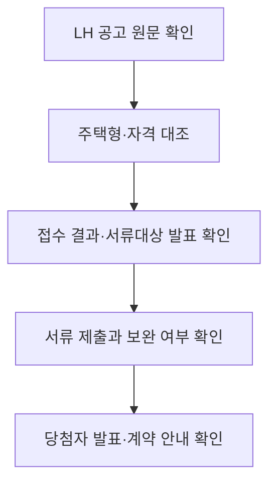

## 핵심 판단

LH청약플러스에 게시된 오산세교 주상5단지(1블록) 행복주택 공고는 2026년 8월 11~13일 접수, 8월 19일 서류제출대상자 발표, 8월 20~26일 서류접수, 10월 28일 당첨자 발표 일정으로 안내돼 있습니다. <mark>접수가 끝난 뒤에는 당첨 여부만 기다리는 것이 아니라 공고문 기준의 대상자 발표·서류·중복선정 제한을 순서대로 확인해야 합니다.</mark> [LH 공고 원문](https://apply.lh.or.kr/lhapply/apply/wt/wrtanc/selectWrtancInfo.do?aisTpCd=10&ccrCnntSysDsCd=03&mi=1026&panId=2015122300020387&uppAisTpCd=06)

## 사업과 공급 유형

공고 페이지는 오산청호 2단지(2블록) 행복주택의 소재지를 경기도 오산시 남부대로 486-13으로 표시하고, 전용면적 16.78~36.94㎡, 총 448세대라고 안내합니다. 주택형별 금회 공급 세대수는 16형 30세대, 26A형 40세대, 26B형 5세대, 36A형 60세대, 36B형 5세대이며 페이지에는 임대보증금과 월임대료는 공고문을 확인하라고 적혀 있습니다. [주택형·공급 세대수](https://apply.lh.or.kr/lhapply/apply/wt/wrtanc/selectWrtancInfo.do?aisTpCd=10&ccrCnntSysDsCd=03&mi=1026&panId=2015122300020387&uppAisTpCd=06)

형별 대상도 다릅니다. 16형·26A형은 대학생·청년·주거급여수급자, 26B형·36B형은 고령자(주거약자용), 36A형은 신혼부부·한부모가족·청년으로 표시됩니다. <mark>면적이 비슷하다는 이유로 모든 주택형의 신청자격이 같다고 볼 수 없으며, 자신의 자격군과 공고일 기준 요건을 원문에서 대조해야 합니다.</mark>

## 일정은 네 단계로 기록한다

| 절차 | 공고 페이지 일정 | 확인할 것 |
| --- | --- | --- |
| 접수 | 8월 11~13일 | 인터넷·모바일 및 현장접수 조건 |
| 서류대상 발표 | 8월 19일 | 발표 시각과 대상 여부 |
| 서류 제출 | 8월 20~26일 | 제출방법·기한·원본 요구 |
| 당첨자 발표 | 10월 28일 | 발표 후 계약 일정 |

LH는 인터넷·모바일 신청에 개인용 공동인증서가 필요할 수 있다고 안내하고, 65세 이상 또는 인터넷 접수가 어려운 사람에 한해 8월 11~12일 현장접수를 허용했습니다. 현장접수와 온라인 접수의 서류 제출 방식도 다를 수 있으므로 접수 완료 화면만으로 모든 절차가 끝났다고 판단하면 안 됩니다. [공급 일정과 접수처](https://apply.lh.or.kr/lhapply/apply/wt/wrtanc/selectWrtancInfo.do?aisTpCd=10&ccrCnntSysDsCd=03&mi=1026&panId=2015122300020387&uppAisTpCd=06)

## 서류와 중복선정의 주의점

공고 페이지는 소득 심사에서 세대주 본인과 배우자, 일정 범위의 세대원 소득을 합산하고 근로·사업·재산·기타소득을 조사한다고 안내합니다. 월평균 소득은 사회보장정보시스템의 공적 자료를 근거로 산정한다고 설명합니다. 신청자가 임의로 계산한 금액과 공적 자료의 범위가 다를 수 있으므로 공고문 산식과 증빙을 확인해야 합니다.

또한 동일 유형 공공임대주택의 예비입주자로 중복선정되지 않으며, 장기임대주택에 입주하면 다른 대기자 명부에서 제외될 수 있다고 안내합니다. 이는 개인의 신청 이력과 세대 구성에 따라 적용 여부가 달라질 수 있는 공고 조건입니다. 청약홈은 분양·청약 관련 공식 확인 창구이지만, 이 LH 임대 공고의 상세 조건과 신청·발표는 LH청약플러스 원문을 기준으로 봐야 합니다. [청약홈](https://www.applyhome.co.kr/) · [LH](https://www.lh.or.kr/)

## 확인 흐름

기본 시나리오는 서류대상자로 선정된 뒤 정해진 기간에 적정 서류를 제출하고, 최종 발표와 계약 안내를 확인하는 것입니다. 반대 시나리오는 신청은 완료했지만 서류 미제출, 기한 경과, 자격 불일치, 중복선정으로 불이익이 생기는 경우입니다. 발표일과 계약기간은 단지·공고별로 달라질 수 있으므로 다른 모집공고의 일정을 가져오면 안 됩니다.

## 체크리스트

- 공고일 기준 무주택·소득·자산·세대 요건 확인
- 신청한 주택형의 대상 계층과 공급 세대수 확인
- 서류제출 대상자 발표 여부와 제출 기한 확인
- 중복선정·대기자 명부 제외 조건 확인
- 최종 발표와 계약 안내를 LH청약플러스에서 재확인

이 글은 LH 공식 공고의 구조를 읽는 방법을 정리한 비개인화 정보입니다. 당첨 가능성을 예측하거나 신청을 보장하지 않으며, 법률·세무·대출 조건은 개인별로 관계기관과 전문가에게 확인해야 합니다.
