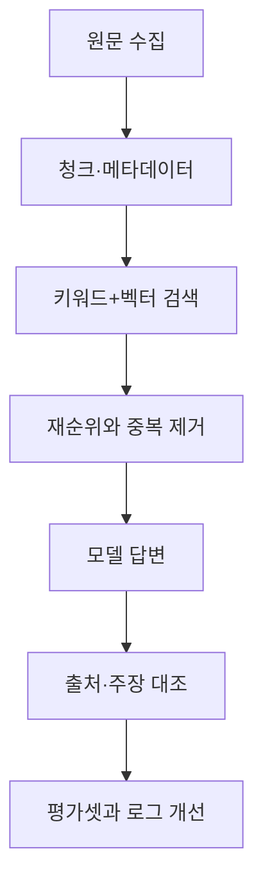

## 핵심 판단

RAG의 다음 단계는 벡터 데이터베이스를 하나 더 붙이는 일이 아니라 질문을 검색 가능한 하위 질문으로 분해하고, 결과의 근거를 다시 확인하는 검색 파이프라인입니다. Microsoft는 이를 agentic retrieval로 설명하며 복잡한 대화를 여러 검색으로 나누고 결과를 통합합니다. <mark>그러나 검색이 똑똑해질수록 정확도는 모델 이름보다 질의 분해·재순위·출처 반환을 측정하는 운영 지표에 달려 있습니다.</mark> [Microsoft RAG 개요](https://learn.microsoft.com/en-us/azure/search/retrieval-augmented-generation-overview)

## 고정형 RAG와 에이전트 검색

고정형 RAG는 질문을 임베딩과 키워드로 검색하고 상위 문서를 모델에 넣어 답을 만드는 구조입니다. 흐름이 단순하고 지연시간과 비용을 예측하기 쉽습니다. 반면 여러 조건이 얽힌 질문에는 한 번의 검색어가 문서의 서로 다른 부분을 놓칠 수 있습니다.

에이전트 검색은 모델이 질문을 작은 하위 질문으로 나누고, 이를 병렬 검색한 뒤 의미 재순위와 통합을 수행합니다. Microsoft 문서에 따르면 결과와 함께 출처 참조와 활동 로그를 반환할 수 있습니다. [Agentic retrieval 개요](https://learn.microsoft.com/en-us/azure/search/agentic-retrieval-overview)

| 비교 항목 | 고정형 RAG | 에이전트 검색 |
| --- | --- | --- |
| 질의 | 한 번의 검색 | 여러 하위 질의 |
| 강점 | 단순성·예측 가능한 비용 | 복합 질문의 범위와 맥락 |
| 위험 | 관련 문서 누락 | 잘못된 분해·비용 증가 |
| 검증 | 검색 적중률·답변 근거 | 분해 품질·각 근거·로그 |

## 문서가 답변보다 먼저다

Azure 문서는 인덱싱 단계에서 긴 문서를 청크로 나누고 임베딩을 만들며, 질의 단계에서는 키워드와 벡터를 함께 쓰는 하이브리드 검색을 권장합니다. 이는 의미가 비슷한 문장만 찾는 벡터 검색과 정확한 제품명·조항·코드값을 찾는 키워드 검색의 역할이 다르기 때문입니다. [Azure RAG 지침](https://learn.microsoft.com/en-us/azure/search/retrieval-augmented-generation-overview)

Google의 Vertex AI RAG Engine도 코퍼스 생성, 파일 가져오기, 청크 크기와 겹침 설정, 상위 결과 수와 거리 임계값 설정을 별도 단계로 둡니다. 즉 RAG 품질은 모델 호출 한 번으로 결정되지 않습니다. <mark>청크 경계가 표·예외 조항·날짜를 잘라 놓으면 검색 단계가 성공해도 답변은 틀릴 수 있습니다.</mark> [Vertex AI RAG quickstart](https://docs.cloud.google.com/vertex-ai/generative-ai/docs/rag-quickstart)

## 품질을 측정하는 순서

먼저 검색 결과가 정답 문서를 포함하는지 측정합니다. 다음으로 모델이 그 문서에서 실제로 답을 만들었는지, 날짜·수치·예외를 보존했는지 봅니다. 마지막으로 출처가 없는 문장을 생성하거나 서로 충돌하는 문서를 섞는 실패를 따로 기록합니다. ‘답변이 자연스럽다’는 평가는 이 세 단계를 대신하지 못합니다.

## 기본 시나리오와 반대 시나리오

정책 문서처럼 질문이 복합적이고 출처가 중요하다면 에이전트 검색이 여러 조건을 분리해 누락을 줄일 수 있습니다. 다만 모든 질문에 에이전트 검색을 적용할 필요는 없습니다. 단순 FAQ나 짧은 제품 매뉴얼은 고정형 검색이 더 빠르고 비용도 통제하기 쉽습니다.

반대 시나리오는 모델에게 검색어를 마음대로 만들게 하고, 하위 질문별 근거를 버린 채 통합 답변만 저장하는 경우입니다. 이때 전체 답변은 그럴듯해도 어떤 문장이 어떤 원문에 근거했는지 추적하기 어렵습니다. 복합 검색을 도입한다면 질의 계획, 검색 결과, 재순위 점수, 최종 인용을 함께 보존해야 합니다.

## 다음 체크포인트

- 하이브리드 검색이 고유명사와 의미 유사 문장을 모두 찾는가
- 청크에 문서 제목·발행일·권한 메타데이터가 붙는가
- 하위 질의 중 하나가 실패했을 때 답변이 이를 표시하는가
- 답변의 핵심 주장마다 출처가 연결되는가
- 비용·지연시간·검색 누락률을 고정형과 비교했는가

에이전트 검색은 정확도를 자동 보장하는 기능이 아니라 복잡성을 검색 단계로 이동시키는 설계입니다. 이 글은 공식 클라우드 문서를 바탕으로 한 기술 해설이며, 실제 데이터의 접근권한·개인정보·보존정책은 서비스별로 별도 검토해야 합니다.

운영 환경에서는 권한 필터도 검색 품질의 일부입니다. 사용자가 볼 수 없는 문서를 검색 결과에 섞은 뒤 답변 단계에서 숨기는 방식은 안전한 접근통제가 아닙니다. 문서별 권한을 색인과 검색 시점에 함께 적용하고, 삭제·갱신이 임베딩 저장소에 언제 반영되는지 기록해야 합니다. <mark>출처가 정확해도 권한이 틀리면 RAG 답변은 정확한 정보 유출이 됩니다.</mark>
