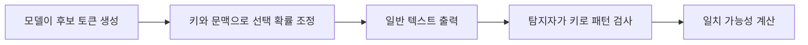

## 핵심 판단

Anthropic은 2026년 8월 14일 앞으로의 Claude 모델이 텍스트 워터마크를 생성할 것이라고 설명했습니다. 여기서 워터마크는 문장에 보이지 않는 문자열을 삽입하는 방식이 아니라, <mark>다음 단어를 고르는 낮은 위험도의 확률 선택에 비밀 키를 반영해 통계적 패턴을 남기는 방식</mark>입니다. [Anthropic의 기술 설명](https://www.anthropic.com/news/claude-text-watermark)

## 무엇이 바뀌는가

대규모 언어 모델은 앞 문맥에 맞는 여러 후보 중 다음 토큰을 확률적으로 선택합니다. 뜻이 거의 달라지지 않는 후보 사이에서 어떤 것을 고르는지는 독자에게 보이지 않는 작은 선택입니다. Anthropic의 설명에 따르면 워터마크는 이 선택의 난수원을 키와 앞선 단어에 연동해, 결과 문장 전체에서 특정 선택 패턴이 나타날 확률을 높입니다.

따라서 독자는 워터마크가 있는 텍스트와 없는 텍스트의 차이를 눈으로 구분하기 어렵습니다. 별도의 숨은 문자나 추가 토큰을 넣지 않으며, 텍스트 품질과 비용에 실질적 영향을 주지 않는다는 것이 회사가 제시한 설명입니다. <mark>워터마크는 ‘Claude가 작성했다’는 신원 증명이 아니라 특정 키와의 통계적 일치 가능성을 높이는 신호</mark>입니다.

## 탐지 흐름

검사자는 텍스트의 단어 배열과 생성 당시의 키를 비교해 워터마크 패턴과 일치할 가능성을 계산합니다. 짧은 문장이나 사람이 크게 편집한 글에서는 관측할 선택이 적어 통계적 신호가 약해집니다. 번역·요약·재작성 과정이 끼어도 원래의 패턴이 보존된다고 단정할 수 없습니다. Anthropic도 워터마크가 특정 개인·조직·대화의 식별정보를 담지 않는다고 설명합니다.

## EU 규정과 기술 선택의 관계

Anthropic은 2026년 7월 여러 주요 모델 개발사와 함께 AI 생성 콘텐츠 투명성에 관한 실천규약에 서명했고, EU AI Act에 맞추기 위해 워터마크를 전 세계적으로 적용한다고 밝혔습니다. 실천규약 원문은 생성·조작 콘텐츠의 표시 방법과 제공자 책임을 다루지만, 구체적인 기술이 모든 사업자에게 하나로 고정된다는 뜻은 아닙니다. [EU AI 생성 콘텐츠 실천규약](https://digital-strategy.ec.europa.eu/en/policies/code-practice-ai-generated-content)

이 구분은 중요합니다. 법·규약은 투명성이라는 목표와 적용 시점을 제시하고, 워터마크는 그 목표를 구현하는 한 방법입니다. 사업자는 워터마크 외에도 사용자 고지, 메타데이터, 출처 추적, 플랫폼 정책을 함께 사용할 수 있습니다. <mark>규정 준수 신호와 콘텐츠의 진위·품질 판정은 서로 다른 문제</mark>입니다.

## 무엇을 보장하지 않는가

첫째, 워터마크가 없다고 사람이 쓴 글이라는 뜻은 아닙니다. 사람의 편집, 다른 모델을 통한 재작성, 오래된 모델의 출력은 신호가 약하거나 없을 수 있습니다. 둘째, 워터마크가 있다고 원문 전체가 Claude의 독창적 산출물이라는 뜻도 아닙니다. 사용자가 제공한 문장을 모델이 다듬었거나 여러 도구가 결합했을 가능성은 별도로 확인해야 합니다.

셋째, 워터마크 탐지는 짧은 텍스트에서 오판할 수 있습니다. 통계 검정은 관측량과 임계값에 따라 거짓 양성·거짓 음성이 생깁니다. 학교나 채용에서 단일 탐지 결과만으로 부정행위를 확정하면 공정성 문제가 커집니다. 탐지 결과는 작성 과정, 버전 기록, 인용과 함께 보조 증거로 다뤄야 합니다.

## 기본 시나리오와 반대 시나리오

기본 시나리오는 플랫폼이 생성 사실을 사용자에게 알리고, 장문의 원문에는 탐지 가능한 신호와 출처 메타데이터를 함께 제공하는 경우입니다. 독자는 결과물의 출처를 더 잘 판단할 수 있고, 서비스는 투명성 요구에 대응할 수 있습니다.

반대 시나리오는 탐지기를 판정기로 오해하는 경우입니다. 짧은 문장을 자동 차단하거나 워터마크 검출만으로 저자와 의도를 추정하면 오판 비용이 커집니다. 모델이 향후 워터마크 방식을 바꾸거나 여러 시스템이 텍스트를 재생성하면 과거 신호와의 호환성도 문제가 됩니다. Anthropic은 현재 방식이 향후 모델에 적용된다고 설명했지만, 모든 외부 모델과 편집 과정의 보존을 보장하지는 않습니다.

## 다음 체크포인트

- 서비스가 생성 사실을 어떤 화면과 약관에서 고지하는가
- 탐지 결과의 통계적 불확실성과 오류율을 공개하는가
- 긴 원문·짧은 답변·번역·편집 사례를 나눠 시험했는가
- 워터마크와 별도로 출처·버전·사람의 검토 기록을 남기는가
- EU 적용 대상과 국내 서비스의 법적 의무를 구분했는가

이 글은 공식 기술 설명과 EU 정책 원문을 바탕으로 한 비개인화 정보입니다. 워터마크 탐지 결과를 법률·교육·채용상의 단독 판단 근거로 사용해서는 안 되며, 구체적인 준수 의무는 관할과 서비스 형태에 따라 전문가 확인이 필요합니다.

