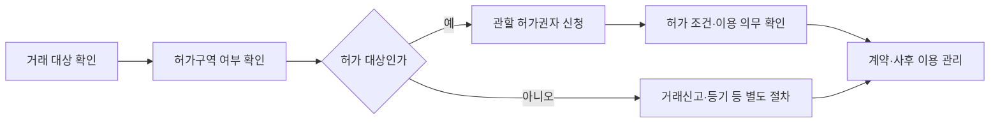

## 핵심 판단

국토교통부는 2026년 8월 20일 외국인 투기 방지를 위한 토지거래허가구역을 1년 연장한다고 발표했습니다. 공개된 핵심은 <mark>2025년 8월 지정한 허가구역의 범위는 그대로 두고 지정기간만 1년 연장한다는 것</mark>이며, 행정구역 변경을 반영해 지정 공고를 정비한다는 내용입니다. [국토교통부 발표 원문](https://www.molit.go.kr/USR/NEWS/m_71/dtl.jsp?id=95092323)

## 확정된 내용과 확정되지 않은 내용

이번 자료에서 확인되는 것은 연장 방향, 기존 구역 범위 유지, 행정구역 변경 반영입니다. 따라서 외국인에 대한 토지거래허가 제도가 새로 전국에 적용되거나 모든 외국인 부동산 거래가 금지된다고 해석할 수 없습니다. 대상 토지와 거래 유형, 허가권자, 이용 의무는 지정 공고와 법령을 함께 확인해야 합니다.

국토부는 별도 2026년 2월 자료에서 외국인 등의 거래신고 때 체류자격·주소·해외자금 조달내역 신고를 확대하고, 계약서와 계약금 영수증 첨부 의무를 신설하는 법 개정이 2월 10일부터 시행된다고 설명했습니다. <mark>토지거래허가와 거래신고 강화는 목적과 절차가 다른 제도</mark>이므로 한 규제를 다른 규제의 적용 요건으로 읽으면 안 됩니다. [거래신고 강화 시행 안내](https://www.molit.go.kr/USR/NEWS/dtl.jsp?id=95091684&lcmspage=5)

## 절차를 흐름으로 보기

실무에서는 계약 전에 주소와 지목·용도, 거래 당사자, 이용 목적을 확인해야 합니다. 허가구역이면 허가를 받을 수 있는지, 허가 후 실제 이용 의무가 무엇인지, 위반 시 어떤 조치가 있는지 관할 지자체에 문의해야 합니다. 허가구역이 아니라도 외국인 거래신고 항목과 자금조달 증빙이 적용될 수 있으므로 신고 시점과 첨부서류를 따로 점검해야 합니다.

## 정책의 전달 경로

| 단계 | 이번 발표에서 확인된 내용 | 추가로 확인할 문서 |
| --- | --- | --- |
| 지정 | 기존 외국인 대상 구역 유지 | 지정 공고·지도 |
| 기간 | 지정기간 1년 연장 | 시작·종료일 |
| 범위 | 행정구역 변경 반영 | 최신 지번·행정구역 |
| 거래 | 허가 대상 여부 판단 필요 | 법령·지자체 안내 |
| 신고 | 외국인 신고자료 확대 | 거래신고 서식·증빙 |

정책 발표는 시장 신호이기도 하지만, 발표된 관리 범위가 곧 거래량이나 가격의 결과를 확정하지는 않습니다. 해당 지역의 수요, 공급, 금융 조건, 거래 상대방의 자격이 함께 작동하기 때문입니다. 정책 목적이 투기 방지라고 해서 정상 거래가 모두 제한되는 것은 아니며, 반대로 허가구역 밖이면 모든 신고 의무가 사라지는 것도 아닙니다.

## 기본 시나리오와 반대 시나리오

기본 시나리오는 기존 구역과 기간을 명확히 해 투기성 거래의 심사와 사후 이용 관리를 이어가는 경우입니다. 행정구역 변경을 반영하면 실무상 주소 확인 오류를 줄일 수 있습니다. 다만 효과를 평가하려면 허가 신청·처리, 실제 이용, 거래신고 적발과 같은 집행 자료가 필요합니다.

반대 시나리오는 발표 내용만 널리 알려지고 최신 지정 공고와 지번 확인이 따라가지 못하는 경우입니다. 거래 당사자가 구역 여부를 잘못 판단하거나 허가와 신고를 혼동할 수 있습니다. 또 외국인 거래 감소가 나타나더라도 가격 안정의 원인이 정책 하나인지 금리·공급·수요 변화인지 분리해야 합니다.

## 다음 체크포인트

- 국토부의 연장 지정 공고에서 정확한 지번과 기간을 확인할 것
- 거래 대상이 허가 대상 토지·주택인지 관할 지자체에 확인할 것
- 허가 전 계약 가능 여부와 이용 의무를 문서로 확인할 것
- 외국인 거래신고의 체류·주소·해외자금 서류를 준비할 것
- 정책 효과와 지역 가격·거래 변화의 인과를 단정하지 않을 것

공식 원문을 확인할 때는 보도자료의 요약 문장만 저장하지 말고 첨부된 지정 공고와 관할 행정기관의 안내까지 함께 보관하는 것이 좋습니다. 같은 행정구역 안에서도 필지와 용도에 따라 적용이 달라질 수 있고, 거래 당사자의 국적·체류자격·법인 여부에 따라 신고서류가 달라질 수 있습니다. 계약서에 허가 또는 신고가 필요한 경우의 책임과 조건을 명확히 적는 것도 분쟁 예방에 도움이 되지만, 그 문구의 법적 효력은 개별 계약 검토가 필요합니다. <mark>가장 중요한 다음 행동은 가격 전망을 세우는 것이 아니라 정확한 주소와 거래 당사자 기준으로 적용 여부를 확인하는 것</mark>입니다.

이 글은 국토교통부 발표와 관련 법령 안내를 읽기 쉽게 정리한 비개인화 정보입니다. 개인의 매수·매도, 계약 체결, 법률·세무 신고를 지시하거나 보장하지 않으며, 실제 거래는 관할 지자체와 법률·세무 전문가의 확인이 필요합니다.
