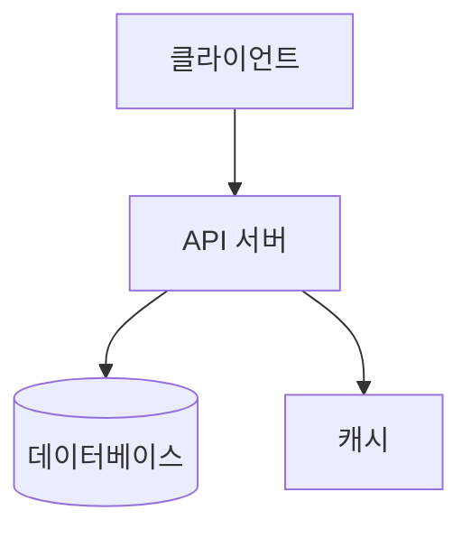

import Base from "../layouts/Base.astro";

<Base title="mermaid smoke" description="mermaid 빌드 타임 렌더링 확인용 스모크 페이지" canonical="https://umanking.github.io/mermaid-smoke/" noindex={true}>

```mermaid
graph TD;
    A[클라이언트] --> B[API 서버];
    B --> C[(데이터베이스)];
    B --> D[캐시];
```

</Base>
